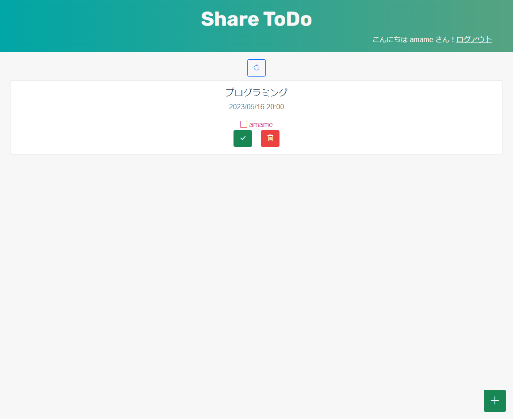

他人とTodoリストの項目をシェアできるWebアプリケーションです。
Go, gin, Vue.jsを使用しています。

使用する際は .env ファイルを追加し
* DB_APP="mysql"
* DB_USER="DBのユーザー名"
* DB_PASSWORD="DBのパスワード"
* DB_HOST="DBの接続先IPとポート"
* DB_DB="使用するデータベース名"

の環境変数情報を先に設定してください。

また、RDBMSは MySQL8.0 以上としテーブルの構築には DB/create.sql を使用してください。

